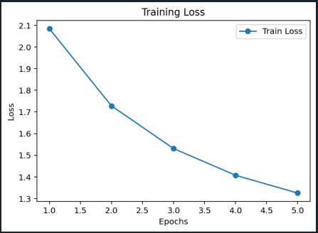
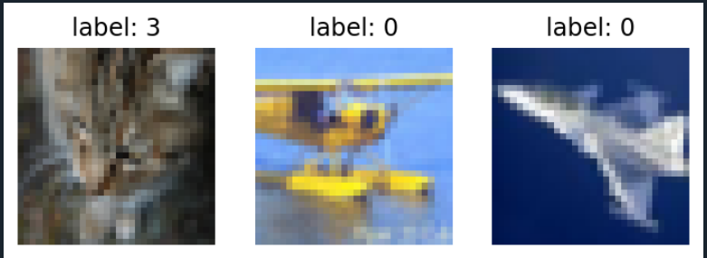

# 🖼️ CIFAR-10 CNN Sınıflandırıcı

PyTorch kullanılarak CIFAR-10 veri seti üzerinde eğitilmiş bir Evrişimli Sinir Ağı (CNN) projesi.

---

## 📌 Proje Hakkında

Bu proje, CIFAR-10 veri setindeki 32x32 boyutundaki renkli görüntüleri 10 farklı sınıfa ayıran bir CNN modeli içermektedir. Model, PyTorch kütüphanesi kullanılarak sıfırdan tasarlanmış ve eğitilmiştir.

CIFAR-10 veri seti şu 10 sınıfı içermektedir:

`uçak` `otomobil` `kuş` `kedi` `geyik` `köpek` `kurbağa` `at` `gemi` `kamyon`

---

## 📂 Proje Yapısı

```
cifar10-cnn-classifier/
│
├── images/
│   ├── cnn_2.PNG         # Eğitim kaybı grafiği
│   └── cnn_3.PNG         # Örnek veri seti görselleri
│
├── cnn.py                # Ana model ve eğitim kodu
├── .gitignore
└── README.md
```

---

## 🧠 Model Mimarisi

```
Girdi (3 x 32 x 32)
    ↓
Conv2D (32 filtre, 3x3) → ReLU → MaxPool
    ↓
Conv2D (64 filtre, 3x3) → ReLU → MaxPool
    ↓
Flatten
    ↓
Fully Connected (4096 → 128) → ReLU → Dropout(0.2)
    ↓
Fully Connected (128 → 10)
    ↓
Çıktı (10 sınıf)
```

| Katman | Detay |
|--------|-------|
| Conv1 | 32 filtre, 3×3 kernel, padding=1 |
| Conv2 | 64 filtre, 3×3 kernel, padding=1 |
| Pooling | MaxPool 2×2, stride=2 |
| Dropout | 0.2 oranı |
| FC1 | 4096 → 128 |
| FC2 | 128 → 10 |

---

## ⚙️ Kullanılan Teknolojiler

- Python 3.x
- PyTorch
- Torchvision
- Matplotlib
- NumPy

---

## 🚀 Kurulum ve Çalıştırma

```bash
# Gerekli kütüphaneleri yükle
pip install torch torchvision matplotlib numpy

# Modeli çalıştır
python cnn.py
```

> CIFAR-10 veri seti ilk çalıştırmada otomatik olarak indirilecektir.

---

## 📊 Eğitim Sonuçları

| Metrik | Değer |
|--------|-------|
| Test Accuracy | %55.42 |
| Train Accuracy | %55.82 |
| Optimizer | SGD (lr=0.001, momentum=0.9) |
| Loss Fonksiyonu | CrossEntropyLoss |
| Epoch | 10 |
| Batch Size | 64 |

### Eğitim Kaybı (Training Loss)



---

## 🖼️ Örnek Veri Seti Görselleri



---

## 📈 Geliştirme Fikirleri

- Daha derin mimari (ResNet, VGG benzeri)
- Data augmentation eklemek
- Learning rate scheduler kullanmak
- Epoch sayısını artırmak
- Adam optimizer denemek
